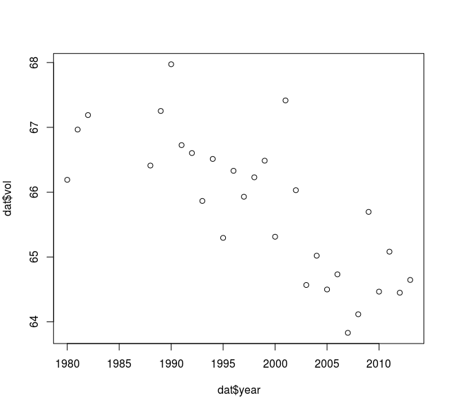

# egg-volumes
Simple example showing how to extract data from opendata.uit.no in R

```R
# First, log in to opendata.uit.no and get an API key. See: 
# http://guides.dataverse.org/en/latest/user/account.html
# for more info. 
Sys.setenv("DATAVERSE_KEY" = "examplekey12345")
Sys.setenv("DATAVERSE_SERVER" = "opendata.uit.no:443")

# Using the dataverse client package, can be found here:
# https://github.com/IQSS/dataverse-client-r
library(dataverse)

# Since we're going to work with excel files
library(xlsx)

# Get the Atlantic puffin Fratercula arctica field data, Hornoya dataset!
# https://opendata.uit.no/dataset.xhtml?persistentId=doi:10.18710/4LABGF
d = dataverse::get_dataset("doi:10.18710/4LABGF")

# Get the raw bytes of the excel file from the dataset 
f =  dataverse::get_file(d$files$datafile$id[2], format="RData")

# raw bytes -> data frame  
tmp <- tempfile(fileext = ".xls")
writeBin(as.vector(f), tmp)

# Read the second sheet (Egg Vol)
dat <- xlsx::read.xlsx(tmp,2)

# Plot egg volume over year 
plot(dat$year, dat$vol)
```

